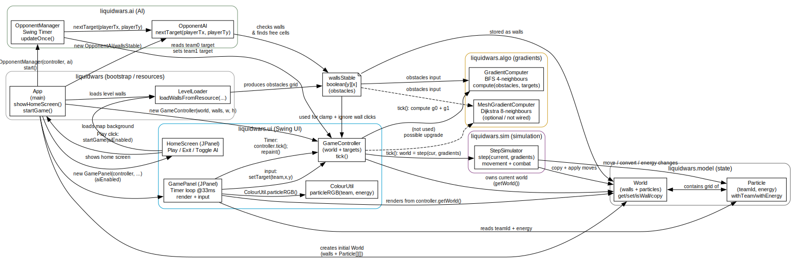

# IFA5E055
Projet de Compléments de Programmation Orientée Objet

# Presentation: Liquid Wars
Ce produit est une implémentation simplifiée du jeu Liquid Wars 6. Notre jeu utilise 2 à 4 équipes de particules qui se déplacent à travers une carte de distances (gradient) vers une cible. Les simulations sont effectuées par « ticks » et l’affichage est réalisé via Swing.
Le code est structuré selon les packages et fichiers suivants (qui ont tous des fichiers de test) :
- liquidwars.model: état du jeu
    - World.java
    - Particle.java
- liquidwars.algo: calcule les gradients
    - GradientComputer.java
    - MeshGradientComputer.java
- liquidwars.sim: règles de simulation
    - StepSimulator.java
- liquidwars.ui: interface Swing
    - HomeScreen.java
    - GamePanel.java
    - GameController.java
    - ColourUtil.java
- liquidwars.ai: adversaire automatisé
    - OpponentAI.java
    - OpponentManager.java
- liquidwars: le jeu compilé
    - App.java
    - LevelLoader.java

## Fonctionnalités des classes

### Models
**World**
- Stocke l’état complet du jeu :
    - obstacles statiques (walls[y][x])
    - contenu dynamique (particles[y][x])
- Responsabilités :
    - accès à la grille (get, set, isWall, vérification des limites)
    - permet de faire une copie afin que la simulation puisse construire un nouvel état à chaque tick

**Particle**
- Représente une unité unique sur la grille, identifiée par teamId et energy
- Implémentée sous forme de record immuable
- Les mises à jour se font en créant de nouvelles particules (withEnergy, withTeam)

### Gradient (Carte de distances)
**GradientComputer**
- Calcule une carte de distances de plus court chemin depuis une ou plusieurs cellules cibles, en présence d’obstacles
- Implémentation :
    - calcul basé sur un parcours en largeur (BFS) qui construit une carte de distances à partir d’une ou plusieurs cellules cibles
    - utilise un voisinage à 4 directions 
- Les distances sont calculées ainsi :
    - les cellules cibles ont une distance de 0
    - les cellules voisines augmentent de +1 par étape (distance de plus court chemin)
    - les obstacles restent inatteignables et reçoivent la valeur INF

**MeshGradientComputer**
- Amélioration de la classe précédente :
    - calcule une carte de distances comme la version BFS, mais avec un voisinage à 8 directions (N, S, E, O + diagonales)
    - produit des trajectoires plus lisses autour des coins par rapport à un BFS strict à 4 voisins
    - conserve les mêmes conventions :
        - les cellules cibles ont une distance de 0
        - les distances se propagent vers l’extérieur (plus court chemin)
        - les obstacles restent inatteignables (INF)
    

### Simulation
**StepSimulator**
- Applique les règles principales du jeu pour un tick : déplacement + combat + énergie
- Implémente un simulateur « un tick » qui met à jour la grille à l’aide du gradient :
    - simulation sur une grille avec obstacles
    - 2 à 4 équipes de particules, énergie bornée (min/max)
    - chaque particule choisit une action selon l’ordre de priorité du sujet :
        - se déplacer (principal → bon → acceptable)
        - attaquer (principal → bon)
        - sinon ne rien faire

### UI
**ColourUtil**
- Convertit (teamId, energy)
- Le facteur de luminosité dépend de l’énergie :
    - une faible énergie reste visible
    - une énergie élevée est plus lumineuse

**GamePanel**
- Écran de jeu : rendu + entrées + boucle de jeu
- Exécute une boucle via javax.swing.Timer (33 fps) :
    - appelle controller.tick()
    - appelle checkGameOver()
    - appelle repaint()
- Rendu :
    - dessine la carte dans une petite BufferedImage
    - dessine des superpositions : cibles, timer, barre de progression, écran de victoire
- Entrées :
    - souris :
        - suit le curseur
    - mode clavier local :
        - WASD

**GameController**
- TLe pont entre l’UI et la simulation :
    - stocke le World courant
    - stocke les cibles pour chaque équipe
    - calcule les gradients
    - invoque StepSimulator.java
- Déroulement à chaque tick :
    1. lire les cibles courantes
    2. calculer le gradient de l’équipe 0
    3. calculer le gradient de l’équipe 1
    4. appeler le simulateur et mettre à jour la référence du monde

**Homescreen**
- 

### AI
**OpponentAI**
- 

**OpponentManager**
- 

### App
- 

### Levelloader
- 

## Compilation, exécution et tests
**Compilation**
Le projet a été construit avec Gradle et compile avec la commande suivante :
    - ./gradlew.bat :app:build

**Exécution**
- Pour lancer le projet avec Gradle, utiliser la commande suivante :
    - ./gradlew.bat :app:run
- Nous avons également lancé le programme en exécutant liquidwars.App depuis l’IDE (VSCode)

**Tests**
- Pour exécuter les tests et vérifier qu’ils passent correctement :
    - ./gradlew.bat :app:test
- Pour exécuter les tests sur des classes spécifiques :
    - ./gradlew.bat :app:test --tests liquidwars.package.TestClass

## Annexes
**Diagramme d’interaction
**

**Architecture de propriété
**

**Cartes**
Les cartes et l’animation GIF ont été dessinées par une amie qui étudie l’art et le design numérique.
  
 

**TODO**
Refinement:
~~Automatic movement of team 2 (also update Compute gradient so that the particles work around the obstacles)~~
~~Add main screen with settings~~
~~Add Timer 
~~Add percentage bar such as in the game~~
~~Add an end screen (and a leave button on the main game screen)~~
~~Make a 1 to 2 proper maps~~
~ button for maps,
~ button for localplay
~ net game (multithreading?)
~ about button
~ oop features
~ multithreading
~ music
~ fps
~ upload gitlab

