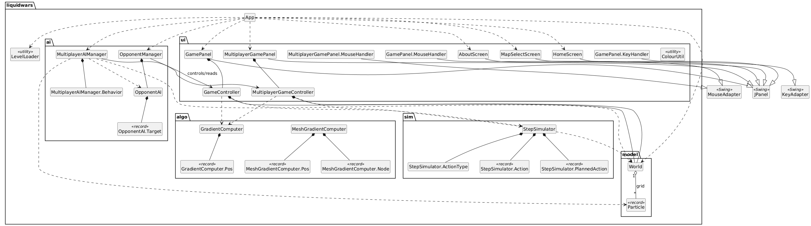
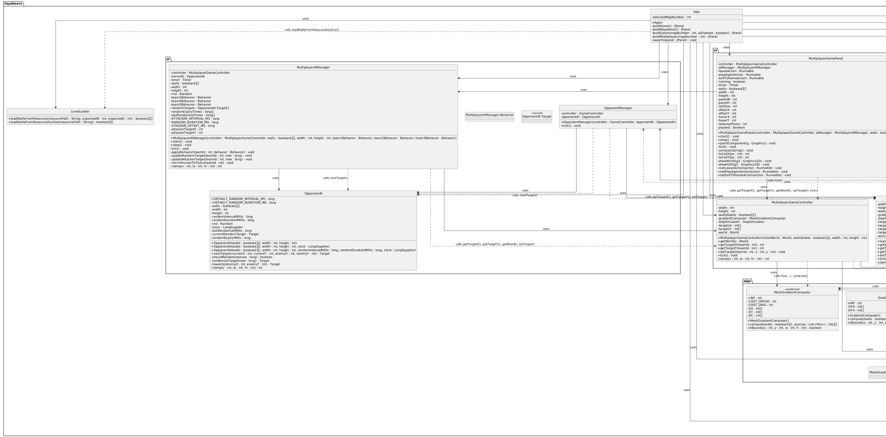

# IFA5E055
Projet de Compléments de Programmation Orientée Objet

Remarque : je suis un étudiant Erasmus venu ici pour apprendre le français, je m'excuse donc par avance pour les éventuelles erreurs grammaticales dans le texte suivant.

# Presentation: Liquid Wars
Ce produit est une implémentation simplifiée du jeu Liquid Wars 6. Notre jeu utilise 2 à 4 équipes de particules qui se déplacent à travers une carte de distances (gradient) vers une cible. Les simulations sont effectuées par « ticks » et l’affichage est réalisé via Swing.
Le code est structuré selon les packages et fichiers suivants (qui ont tous des fichiers de test) :
- liquidwars.model: état du jeu
    - World.java
    - Particle.java
- liquidwars.algo: calcule les gradients
    - GradientComputer.java
    - MeshGradientComputer.java
- liquidwars.sim: règles de simulation
    - StepSimulator.java
- liquidwars.ui: interface Swing
    - HomeScreen.java
    - GamePanel.java
    - GameController.java
    - ColourUtil.java
- liquidwars.ai: adversaire automatisé
    - OpponentAI.java
    - OpponentManager.java
- liquidwars: le jeu compilé
    - App.java
    - LevelLoader.java

## Fonctionnalités des classes

### Models
**World**
- Stocke l’état complet du jeu :
    - obstacles statiques (walls[y][x])
    - contenu dynamique (particles[y][x])
- Responsabilités :
    - accès à la grille (get, set, isWall, vérification des limites)
    - permet de faire une copie afin que la simulation puisse construire un nouvel état à chaque tick

**Particle**
- Représente une unité unique sur la grille, identifiée par teamId et energy
- Implémentée sous forme de record immuable
- Les mises à jour se font en créant de nouvelles particules (withEnergy, withTeam)

### Gradient (Carte de distances)
**GradientComputer**
- Calcule une carte de distances de plus court chemin depuis une ou plusieurs cellules cibles, en présence d’obstacles
- Implémentation :
    - calcul basé sur un parcours en largeur (BFS) qui construit une carte de distances à partir d’une ou plusieurs cellules cibles
    - utilise un voisinage à 4 directions 
- Les distances sont calculées ainsi :
    - les cellules cibles ont une distance de 0
    - les cellules voisines augmentent de +1 par étape (distance de plus court chemin)
    - les obstacles restent inatteignables et reçoivent la valeur INF

**MeshGradientComputer**
- Amélioration de la classe précédente :
    - calcule une carte de distances comme la version BFS, mais avec un voisinage à 8 directions (N, S, E, O + diagonales)
    - produit des trajectoires plus lisses autour des coins par rapport à un BFS strict à 4 voisins
    - conserve les mêmes conventions :
        - les cellules cibles ont une distance de 0
        - les distances se propagent vers l’extérieur (plus court chemin)
        - les obstacles restent inatteignables (INF)
    

### Simulation
**StepSimulator**
- Applique les règles principales du jeu pour un tick : déplacement + combat + énergie
- Implémente un simulateur « un tick » qui met à jour la grille à l’aide du gradient :
    - simulation sur une grille avec obstacles
    - 2 à 4 équipes de particules, énergie bornée (min/max)
    - chaque particule choisit une action selon l’ordre de priorité du sujet :
        - se déplacer (principal → bon → acceptable)
        - attaquer (principal → bon)
        - sinon ne rien faire

### UI
**ColourUtil**
- Convertit (teamId, energy)
- Le facteur de luminosité dépend de l’énergie :
    - une faible énergie reste visible
    - une énergie élevée est plus lumineuse

**GamePanel**
- Écran de jeu : rendu + entrées + boucle de jeu
- Exécute une boucle via javax.swing.Timer (33 fps) :
    - appelle controller.tick()
    - appelle checkGameOver()
    - appelle repaint()
- Rendu :
    - dessine la carte dans une petite BufferedImage
    - dessine des superpositions : cibles, timer, barre de progression, écran de victoire
- Entrées :
    - souris :
        - suit le curseur
    - mode clavier local :
        - WASD

**GameController**
- Le pont entre l’UI et la simulation :
    - stocke le World courant
    - stocke les cibles pour chaque équipe
    - calcule les gradients
    - invoque StepSimulator.java
- Déroulement à chaque tick :
    1. lire les cibles courantes
    2. calculer le gradient de l’équipe 0
    3. calculer le gradient de l’équipe 1
    4. appeler le simulateur et mettre à jour la référence du monde

**Homescreen**
- utilise JButton pour initialiser les boutons
- Boutons
    -"Play
        - commence le jeu avec le mode et la carte sélectionnés (le mode par défaut est vs AI, la carte par défaut = map1)
    - "Map Select"
        - entre dans un nouvel écran où l'utilisateur peut choisir parmi les cartes disponibles
    - "vs AI"
        - mode utilisateur contre IA
    - "Local Play"
        - mode deux joueurs
    - "Multiplayer"
        - utilisateur contre IA contre IA contre IA
    - "Exit" 
    - "About" 
        - entre dans un nouvel écran avec des informations sur le jeu
fichiers:
- HomeScreen.java
- HomeScreenTest.java

**AboutScreen**
- écran d'informations simple affichant les crédits en utilisant une disposition fixe
- contient un bouton "back" qui retourne au Homescreen

fichiers:
- AboutScreen.java
- AboutScreenTest.java

**MapSelectScreen**
- écran dédié pour choisir entre les cartes de jeu
- accessible via le bouton dans le Homescreen
- le bouton "Next Map" parcourt les cartes disponibles (1-5)
- chaque fois qu'une carte est accédée, l'arrière-plan de MapSelectScreen devient cette carte pour l'aperçu
- le choix de la carte sélectionnée est préservé et retourne la carte sélectionnée au Homescreen

fichiers:
- MapSelectScreen.java
- MapSelectScreenTest.java

**MultiplayerGamePanel**
- rendu du jeu + entrées pour le mode multijoueur
- le joueur contrôle l'équipe 0 via l'entrée souris, les équipes 1-3 sont contrôlées par l'IA
- affiche 4 barres de progression, une par équipe
- conditions de victoire
- inclut les boutons "Play Again" et "Exit to Home" sur l'écran de victoire

fichiers:
- MultiplayerGamePanel.java
- MultiplayerGamePanelTest.java

**MultiplayerGameController**
- contrôleur pour le mode multijoueur, isolé du GameController à 2 équipes
- gère l'état du monde et les cibles pour 4 équipes
- calcule 4 gradients séparés + invoque StepSimulator avec toutes les données d'équipe par tick
- contraint les coordonnées à l'espace disponible (excluant les murs et la bordure)

ficheirs:
- MultiplayerGameController.java
- MultiplayerGameControllerTest.java

### AI
**OpponentAI**
- reflète la cible du joueur avec une sélection de cible aléatoire toutes les 5 secondes + reste à cet endroit pendant 2 secondes (repli sur la cellule libre la plus proche si la cible est un mur)

files:
- OpponentAI.java
- OpponentAITest.java

**OpponentManager**
- pilote OpponentAI pour le mode à 2 équipes vs IA
  
fichiers:
- OpponentManager.java
- OpponentManagerTest.java
  
**MultiplayerAIManager**
- gère trois comportements de bot randomisés pour les équipes 1-3 :
	- bot1, - reflète l'entrée utilisateur comme en mode vs AI, utilise OpponentAI
	- bot2, - attaque le joueur ennemi le plus proche
	- bot3, - reflète le bot 2
- Les équipes 1-3 alternent entre les 'rôles' (bot1-3) à chaque partie
- les bots2 et 3 randomisent leurs mouvements plus fréquemment
- tous les bots randomisent leurs mouvements à des intervalles décalés, aucun mouvement synchronisé

Fichiers:
- MultiplayerAIManager.java
- MultiplayerAIManagerTest.java

### App
- contient main()
- crée le placement initial des particules pour les équipes 0,1
- respecte les murs et ne place jamais de particules sur les bordures

files:
- App.java
- AppTest.java

### Levelloader
- charge les cartes depuis les images PNG et png dans le dossier resources
- convertit les pixels sombres en murs et les pixels clairs en espace ouvert
- transforme les cellules de bordure en murs
- supporte les dimensions d'image fixes et variables (s'adapte aux cartes 2-5 capturées manuellement)

fichiers:
- LevelLoader.java
- LevelLoaderTest.java

## Compilation, exécution et tests
**Compilation**
Le projet a été construit avec Gradle et compile avec la commande suivante :
    - ./gradlew.bat :app:build

**Exécution**
- Pour lancer le projet avec Gradle, utiliser la commande suivante :
    - ./gradlew.bat :app:run
- Nous avons également lancé le programme en exécutant liquidwars.App depuis l’IDE (VSCode)

**Tests**
- Pour exécuter les tests et vérifier qu’ils passent correctement :
    - ./gradlew.bat :app:test
- Pour exécuter les tests sur des classes spécifiques :
    - ./gradlew.bat :app:test --tests liquidwars.package.TestClass

## Annexes
**Architecture logicielle**
**

**Diagramme de classes détaillé (champs, méthodes et relations d'appel)**

**Cartes**
Les cartes et l’animation GIF ont été dessinées par une amie qui étudie l’art et le design numérique.
  
 

**TODO**
Refinement:
~~Automatic movement of team 2 (also update Compute gradient so that the particles work around the obstacles)~~
~~Add main screen with settings~~
~~Add Timer 
~~Add percentage bar such as in the game~~
~~Add an end screen (and a leave button on the main game screen)~~
~~Make a 1 to 2 proper maps~~
~ button for maps,
~ button for localplay
~ net game (multithreading?)
~ about button
~ oop features
~ multithreading
~ music
~ fps
~ upload gitlab

